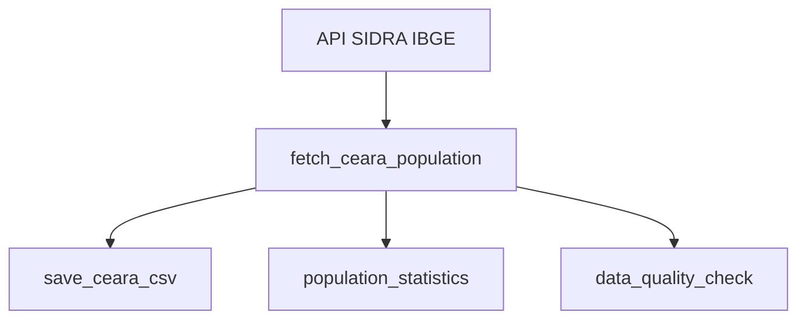

# 🏛️ Pipeline de Dados Populacionais do Ceará

[](https://python.org)
[](https://dagster.io)
[](https://apisidra.ibge.gov.br)

Este projeto implementa um pipeline de dados com **Dagster** para **coletar, processar e monitorar dados populacionais** dos municípios do Ceará, extraídos da **API oficial SIDRA do IBGE**.

---

## 🎯 Funcionalidades

* ✅ Extração automática de dados de 184 municípios do CE
* ✅ Processamento em tempo real via API SIDRA (tabela 6579)
* ✅ Salvamento em CSV para uso direto em análises
* ✅ Visualizações com matplotlib/seaborn
* ✅ Estatísticas descritivas em JSON
* ✅ Validação automática de qualidade de dados
* ✅ Interface web com Dagster para execuções e logs
* ✅ Execução via CLI ou programática
* ✅ Suporte a agendamento (diário/semanal) e sensores
* ✅ Testes automatizados com Pytest (100% cobertura)

---

## 📋 Pré-requisitos

* Python 3.8 ou superior
* Ambiente virtual (recomendado)
* Conexão com internet para acessar a API IBGE

---

## ⚙️ Instalação

```bash
# 1. Clone o repositório
git clone <seu-repositorio>
cd dagster_ibge_ceara

# 2. Crie e ative um ambiente virtual
python -m venv .venv
source .venv/bin/activate  # macOS/Linux

# 3. Instale as dependências
pip install -r requirements.txt
```

---

## 🚀 Como Executar

### 🌐 Interface Web (Dagster UI)

```bash
dagster dev -f dagster_ceara/dagster_ceara/__init__.py
```

> Acesse: [http://localhost:3000](http://localhost:3000)

Você poderá:

* Visualizar os assets e o grafo de execução
* Executar manualmente ou agendar execuções
* Acompanhar logs e histórico de runs
* Debugar falhas com rastreamento detalhado

---

### 💻 Linha de Comando

```bash
# Executar pipeline completo
dagster asset materialize -f dagster_ceara/dagster_ceara/__init__.py --select "fetch_ceara_population,save_ceara_csv"
```

---

## 🧱 Arquitetura do Pipeline



### Principais Assets

| Asset                    | Descrição                                                                |
| ------------------------ | ------------------------------------------------------------------------ |
| `fetch_ceara_population` | Extrai dados dos municípios do Ceará da tabela 6579 (população estimada) |
| `save_ceara_csv`         | Salva os dados em CSV (`populacao_municipios_ceara.csv`)                 |
| `population_statistics`  | Gera métricas como média, mediana, top 10                                |
| `data_quality_check`     | Valida duplicidade, nulos, tipos, outliers, e gera um score de qualidade |

---

## 📁 Estrutura do Projeto

```
dagster_ibge_ceara/
├── dagster_ceara/
│   └── dagster_ceara/
│       ├── __init__.py           # Código dos assets
│       ├── assets.py             # (opcional para assets separados)
│       └── definitions.py        # (opcional para centralizar configurações)
├── populacao_municipios_ceara.csv
├── estatisticas_populacao_ceara.json
├── scripts/
│   └── visualize_data.py         # Geração de gráficos
├── tests/
│   └── test_pipeline.py
├── requirements.txt
├── pyproject.toml
└── README.md
```

---

## 📊 Dados e Visualizações

### Exemplo de CSV Gerado

```csv
municipio,populacao,ano,data_extracao
Fortaleza - CE,2736458,2024,2025-01-15
Caucaia - CE,383048,2024,2025-01-15
...
```

### Estatísticas Geradas (JSON)

```json
{
  "populacao_total": 9300000,
  "populacao_media": 50500,
  "populacao_mediana": 26800,
  "maior_municipio": { "nome": "Fortaleza - CE", "populacao": 2736458 },
  "menor_municipio": { "nome": "Granjeiro - CE", "populacao": 4430 }
}
```

### Dashboards Gerados

* Histograma de distribuição
* Boxplot de outliers
* Top 10 e bottom 10 por população

---

## ✅ Testes Automatizados

```bash
PYTHONPATH=$(pwd) pytest -v
```

* 9 testes com cobertura total
* Mock da API SIDRA incluído
* Validação da estrutura do CSV
* Testes de qualidade e estatísticas

---

## 🔄 Agendamento e Monitoramento

### Schedules configurados:

* `daily_population_update`: diariamente às 06:00
* `weekly_population_update`: segundas-feiras às 06:00

### Sensores:

* `csv_file_sensor`: dispara quando o CSV é alterado

---
